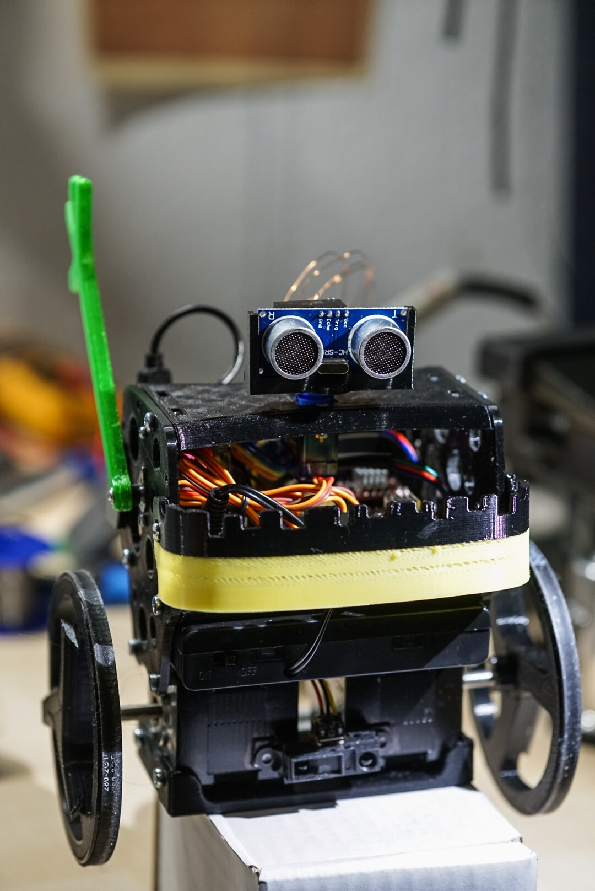
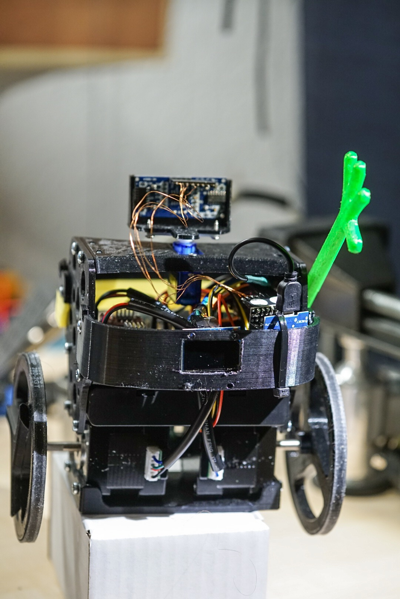
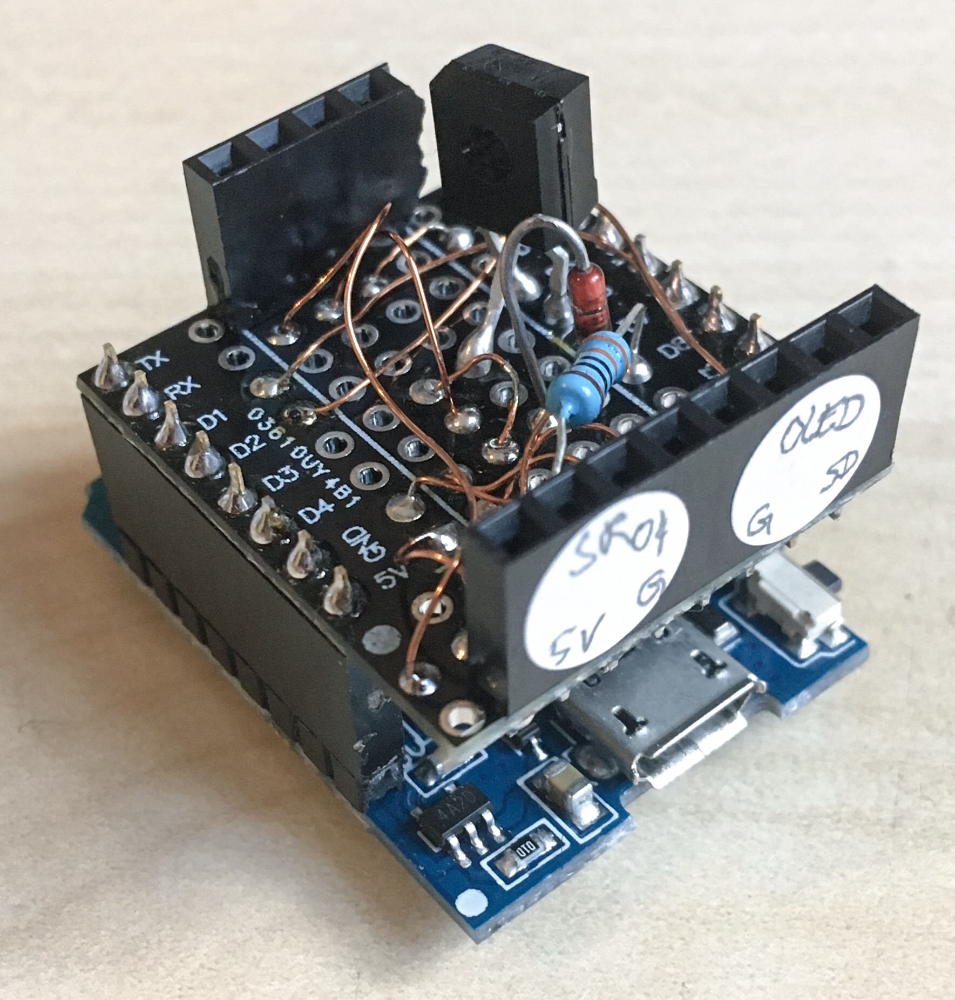

# Obstacle Avoiding B-Robot EVO
  

Hardware: 
- Board: WEMOS/LOLIN D1 MINI 
- HC-SR04 Ultrasonic Sensor https://github.com/jshaw/NewPingESP8266 
- SG90 Micro Servo
electroic components:
- a Zener Diode und a 330 Ohm Resistor for the HC-SR04: https://www.letscontrolit.com/wiki/index.php/HC-SR04#Connecting_using_a_Zener_Diode

optional: (remove the corresponding code)
- Infrared Sensor TSOP4838: move and start the autonomous mode, and a arbitrary ir-remote (i used an AppleTV3 remote)
- Sharp Infrared distance Sensor GP2Y0A21YK0F 
- OLED https://github.com/ThingPulse/esp8266-oled-ssd1306

Software:
- IDE used Arduino IDE 1.8.9  
- For OSC communication with devia board: https://github.com/CNMAT/OSC
- no need to modify the original Firmware from BRobot! 
- SG90 Micro Servo for the ultrasonic sensor is connected to PIN SERVO1 on the Devia board and controlled via OSC /1/fader3/
- micro usb from wemos board is powered by AUX +5V and Ground

Details and questions here: http://forums.jjrobots.com/showthread.php?tid=2327 

- Sonar function not used at the moment, a compass modul will be a nice option
required wiring should be obvious from the code

